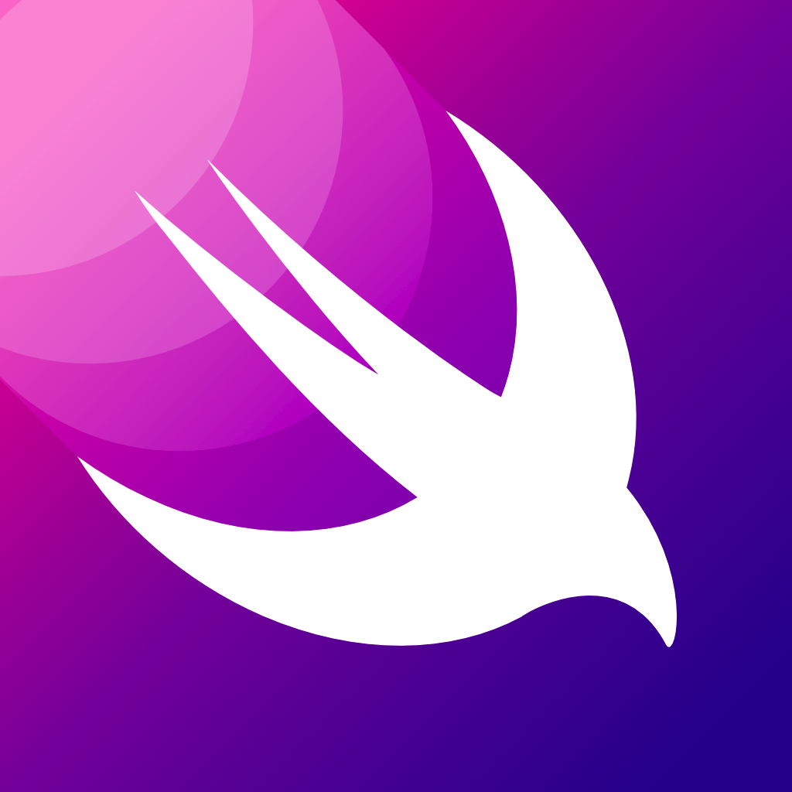

# Todoey - iOS Todo App

Todoey is a stylish and feature-rich Todo app designed for iOS, developed using UIKit, Core Data, and Chameleon Framework. It provides users with a seamless and intuitive task management experience, allowing them to organize their daily tasks efficiently.

## Key Features

- **Intuitive Interface:** Todoey offers a clean and user-friendly interface that makes task management a breeze.
- **Create and Manage Tasks:** Users can easily create, edit, and delete tasks with just a few taps.
- **Priority Levels:** Assign priority levels to tasks, helping users focus on what's most important.
- **Task Categories:** Organize tasks into categories or projects to keep everything well-structured.
- **Colorful Themes:** Utilizing the Chameleon Framework, Todoey offers a visually appealing theme.
- **Data Persistence:** Core Data ensures all task data is securely saved and easily retrievable across app launches.
- **Search Functionality:** Quickly find specific tasks using the built-in search feature.
- **Swipe Actions:** Effortlessly mark tasks as completed or delete them with simple swipe gestures.
- **Cloud Sync (Future Plan):** We are actively working on integrating cloud sync functionality to access tasks across multiple devices.

## Installation

To install Todoey on your iOS device, follow these simple steps:

1. Clone the repository: `git clone https://github.com/adityasinghjadon03/Todoey.git`
2. Navigate to the project directory: `cd Todoey`
3. Open `Todoey.xcodeproj` in Xcode.
4. Connect your iOS device, select it as the target, and click on the "Run" button (or use the simulator).
5. Make sure to perform pod installation.

## Requirements

- iOS 13.0+
- Xcode 12.0+
- Swift 5.0+

## Dependencies

Todoey utilizes the following third-party library:

- Chameleon Framework: A powerful framework to easily create color schemes and themes.

## Contributing

We welcome contributions to enhance Todoey and make it even better! If you would like to contribute, please follow these steps:

1. Fork the repository.
2. Create a new branch for your feature: `git checkout -b feature/your-feature`
3. Commit your changes: `git commit -m 'Add your feature'`
4. Push to the branch: `git push origin feature/your-feature`
5. Open a pull request to the `main` branch.

## License

Todoey is released under the [MIT License](LICENSE).

## Acknowledgments

We extend our gratitude to the developers and contributors of the Chameleon Framework for their exceptional work and Angela Yu's amazing iOS Developer bootcamp.

## Contact

If you have any questions, suggestions, or feedback, feel free to contact us:

- Email: adityasinghjadon03@gmail.com

Happy task managing with Todoey! 🚀
